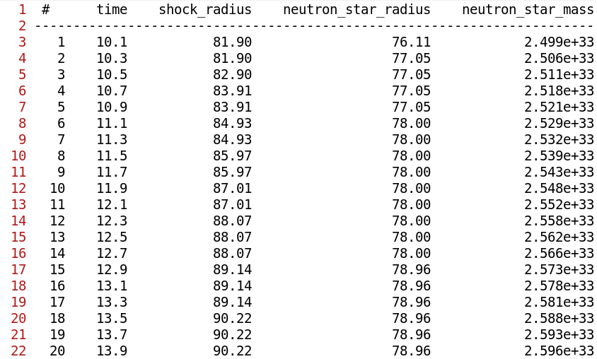

# HDF5 to Text Table

This little script helps you convert data from a HDF5 file into a table in text format.



## Usage

The script takes the following arguments:

```
usage: hdf5_to_text_table [-h] [-o OUTPUT] [-c COLUMNS] [-p PRECISION] [--ignore IGNORE] [--delimiter DELIMITER] [-f] [-n] [-v] [--overwrite] [--preview] filename

Convert HDF5 data into a table in text format

Read all one-dimensional data from the given HDF5 file and
write it into a table in text format. Each dataset will be
converted into a column inside the table.

We support HDF5 datasets and groups, and consider only
one-dimensional data with more than one element.

positional arguments:
  filename

options:
  -h, --help            show this help message and exit
  -o OUTPUT, --output OUTPUT
                        output file (based on input filename if not given)
  -c COLUMNS, --columns COLUMNS
                        comma-separated list of columns
  -p PRECISION, --precision PRECISION
                        precision format string (either one for all columns, or a comma-separated list of format strings)
  --ignore IGNORE       comma-separated list of data entries to be ignored
  --delimiter DELIMITER
                        delimiter (default is four spaces)
  -f, --full-name       use full tree description as name in header
  -n, --number          number all rows
  -v, --verbose         explain what is being done
  --overwrite           overwrite existing output file
  --preview             preview table in terminal
```

## Installation

After downloading you can simply use pip to install the script:

```bash
pip install <PATH_TO_HDF5_TO_TEXT_TABLE>
```